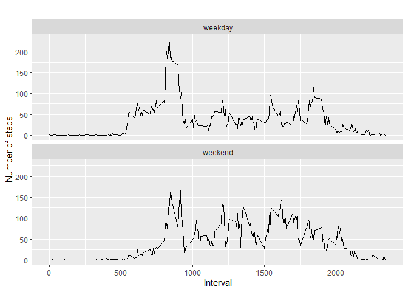

## Loading and preprocessing the data

```r
library(dplyr)
```

```
## 
## Attaching package: 'dplyr'
```

```
## The following objects are masked from 'package:stats':
## 
##     filter, lag
```

```
## The following objects are masked from 'package:base':
## 
##     intersect, setdiff, setequal, union
```

```r
library(lubridate)
```

```
## 
## Attaching package: 'lubridate'
```

```
## The following objects are masked from 'package:base':
## 
##     date, intersect, setdiff, union
```

```r
library(ggplot2)
library(httpuv)

# Load file and have a quick look
   Rawdataset <- read.csv('activity.csv')
   dataset <- Rawdataset[ with (Rawdataset, { !(is.na(steps)) } ), ]
   # Clean up date class
   dataset$date <- ymd(dataset$date)
  
   # Remove NA
   dataset <- na.omit(dataset)

   head(dataset) 
```

```
##     steps       date interval
## 289     0 2012-10-02        0
## 290     0 2012-10-02        5
## 291     0 2012-10-02       10
## 292     0 2012-10-02       15
## 293     0 2012-10-02       20
## 294     0 2012-10-02       25
```


## What is mean total number of steps taken per day?


```r
library(dplyr)
Groupby_day <- group_by(dataset, date)
stepsby_day <- summarise(Groupby_day, total = sum(steps))
```

```
## `summarise()` ungrouping output (override with `.groups` argument)
```

```r
stepsby_day
```

```
## # A tibble: 53 x 2
##    date       total
##    <date>     <int>
##  1 2012-10-02   126
##  2 2012-10-03 11352
##  3 2012-10-04 12116
##  4 2012-10-05 13294
##  5 2012-10-06 15420
##  6 2012-10-07 11015
##  7 2012-10-09 12811
##  8 2012-10-10  9900
##  9 2012-10-11 10304
## 10 2012-10-12 17382
## # ... with 43 more rows
```

```r
hist(stepsby_day$total, main="Histogram of total number of steps per day", 
     xlab="Total number of steps in a day")
```

<!-- -->

```r
# the summary 
summary(stepsby_day)
```

```
##       date                total      
##  Min.   :2012-10-02   Min.   :   41  
##  1st Qu.:2012-10-16   1st Qu.: 8841  
##  Median :2012-10-29   Median :10765  
##  Mean   :2012-10-30   Mean   :10766  
##  3rd Qu.:2012-11-16   3rd Qu.:13294  
##  Max.   :2012-11-29   Max.   :21194
```

```r
# mean value 
names(stepsby_day)
```

```
## [1] "date"  "total"
```

```r
round(mean(complete.cases(dataset$steps) ))
```

```
## [1] 1
```

```r
# Median value
median(stepsby_day$steps)
```

```
## Warning: Unknown or uninitialised column: `steps`.
```

```
## NULL
```


## What is the average daily activity pattern?

```r
# preprocessing data for plot
stepsby_interval <- aggregate(steps ~ interval, dataset, mean)

# create a time series plot 
plot(stepsby_interval$interval, stepsby_interval$steps, type='l', 
     main="Average number of steps over all days", xlab="Interval", 
     ylab="Average number of steps")
```

<!-- -->

```r
# find row with max of steps
max_steps_row <- which.max(stepsby_interval$steps)

# find interval with this max
stepsby_interval[max_steps_row, ]
```

```
##     interval    steps
## 104      835 206.1698
```


## Imputing missing values

1. Calculate and report the total number of missing values in the dataset (i.e. the total number of rows with NAs)


```r
sum(is.na(Rawdataset))
```

```
## [1] 2304
```

2. Devise a strategy for filling in all of the missing values in the dataset. The strategy does not need to be sophisticated. For example, you could use the mean/median for that day, or the mean for that 5-minute interval, etc.


```r
data_imputed <- Rawdataset
for (i in 1:nrow(data_imputed)) {
  if (is.na(data_imputed$steps[i])) {
    interval_value <- data_imputed$interval[i]
    steps_value <- stepsby_interval[
      stepsby_interval$interval == interval_value,]
    data_imputed$steps[i] <- steps_value$steps
  }
}
```


3. Create a new dataset that is equal to the original dataset but with the missing data filled in.
 New dataset with all NA's are replaced with mean of 5-minute interval

```r
imputed_stepsby_day <- aggregate(steps ~ date, data_imputed, sum)
head(imputed_stepsby_day)
```

```
##         date    steps
## 1 2012-10-01 10766.19
## 2 2012-10-02   126.00
## 3 2012-10-03 11352.00
## 4 2012-10-04 12116.00
## 5 2012-10-05 13294.00
## 6 2012-10-06 15420.00
```


4. Make a histogram of the total number of steps taken each day and Calculate and report the mean and median total number of steps taken per day. Do these values differ from the estimates from the first part of the assignment? What is the impact of imputing missing data on the estimates of the total daily number of steps?


```r
hist(imputed_stepsby_day$steps, main="Histogram of total number of steps per day (imputed)", 
     xlab="Total number of steps in a day")
```

<!-- -->


```r
# get mean and median of imputed data
mean(imputed_stepsby_day$steps)
```

```
## [1] 10766.19
```

```r
median(imputed_stepsby_day$steps)
```

```
## [1] 10766.19
```

```r
# get mean and median of data without NA's
mean(stepsby_day$total)
```

```
## [1] 10766.19
```

```r
median(stepsby_day$total)
```

```
## [1] 10765
```


## Are there differences in activity patterns between weekdays and weekends?

For this part the weekdays() function may be of some help here. Use the dataset with the filled-in missing values for this part.

1. Create a new factor variable in the dataset with two levels - "weekday" and "weekend" indicating whether a given date is a weekday or weekend day.


```r
data_imputed['type_of_day'] <- weekdays(as.Date(data_imputed$date))
data_imputed$type_of_day[data_imputed$type_of_day  %in% c('Saturday','Sunday') ] <- "weekend"
data_imputed$type_of_day[data_imputed$type_of_day != "weekend"] <- "weekday"
```


2. Make a panel plot containing a time series plot (i.e. type = "l") of the 5-minute interval (x-axis) and the average number of steps taken, averaged across all weekday days or weekend days (y-axis). See the README file in the GitHub repository to see an example of what this plot should look like using simulated data.


```r
# convert type_of_day from character to factor
data_imputed$type_of_day <- as.factor(data_imputed$type_of_day)

# calculate average steps by interval across all days
imputed_steps_by_interval <- aggregate(steps ~ interval + type_of_day, data_imputed, mean)

# creat a plot
qplot(interval, 
      steps, 
      data = imputed_steps_by_interval, 
      type = 'l', 
      geom=c("line"),
      xlab = "Interval", 
      ylab = "Number of steps", 
      main = "") +
  facet_wrap(~ type_of_day, ncol = 1)
```

```
## Warning: Ignoring unknown parameters: type
```

<!-- -->


